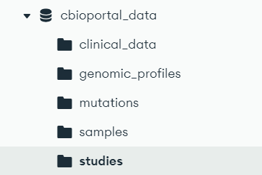
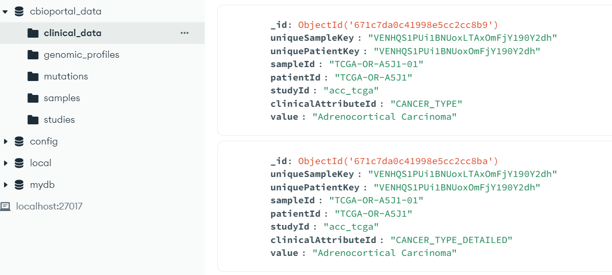
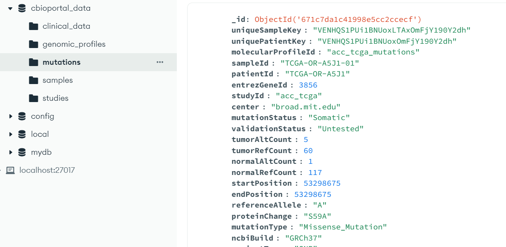
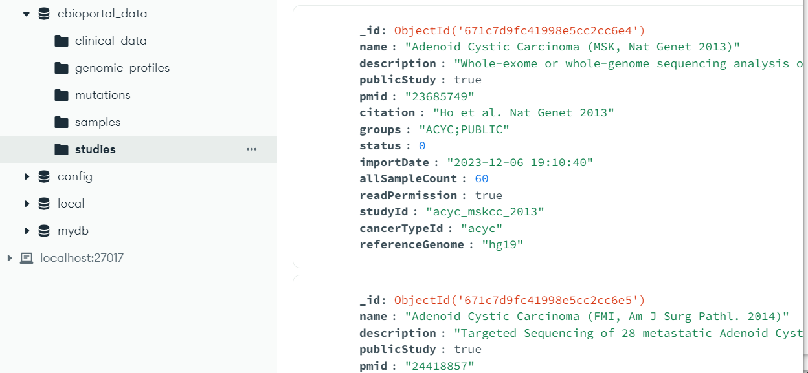

# cbio_ml_pl

cbio machine learning pipeline

`cbio_ml_pl` is a machine learning pipeline framework designed for seamless integration with cBioPortal data. This interface module enables cancer genomics data to be fetched, processed, and prepared for machine learning applications as part of a larger Informatics Controller system. The `cbio_ml_pl` interface is modular, allowing it to integrate easily into broader pipelines while handling cBioPortal-specific data processing.

## Pipeline Overview

### MongoDB Collections

The pipeline currently supports the following collections in MongoDB:

- **clinical_data**: Patient-level data with clinical details.
- **mutations**: Genomic mutations relevant to cancer studies.
- **studies**: Metadata about each cancer study available in cBioPortal.

Data is parsed from cBioPortal using socket connections and dumped directly into these MongoDB collections.

### Data Flow

1. **Data Retrieval**: Data is retrieved from cBioPortal using sockets.
2. **Data Parsing**: Retrieved data is parsed into structured formats.
3. **MongoDB Storage**: Parsed data is stored in MongoDB collections.
4. **ML Pipeline Preparation**: Data is processed, normalized, and standardized for machine learning.



## Collection Descriptions and Examples

Below are examples of the data for each collection currently in use.

### Clinical Data

The **clinical_data** collection includes detailed clinical information about patients, including demographics, disease status, and treatments.



### Mutations

The **mutations** collection holds information on gene mutations relevant to cancer genomics. This data helps in identifying mutation patterns across different patient cohorts.



### Studies

The **studies** collection contains metadata for each cancer study available in cBioPortal. This includes study identifiers, titles, descriptions, and relevant publications.



## Features

- **Modular cBioPortal Interface**: Simplified classes to fetch data from cBioPortal (e.g., clinical data, mutations, cancer types, gene panels, case lists).
- **Data Preprocessing**: ML preprocessing functionalities for data normalization, standardization, and feature selection.
- **Socket-Based Integration**: Designed for easy data export and pipeline integration, supporting various ML frameworks.
- **Flexible and Extensible**: Can be easily customized for different data types, preprocessing steps, and machine learning tasks.

## Installation

Clone the repository:

```bash
git clone https://github.com/jeramee/cbio_ml_pl.git
cd cbio_ml_pl
```

### Create an `environment.yml` file in the project root directory:

```yaml
name: cbio_ml_pl_env
channels:
  - defaults
dependencies:
  - python=3.8
  - pandas
  - requests
  - scikit-learn
  - pytest
  # Add other dependencies as needed
```

### Install the environment with Conda:

```bash
conda env create -f environment.yml
```

### Activate the environment:

```bash
conda activate cbio_ml_pl_env
```

# Usage

### Setting up the cBioPortal Interface

Define the cBioPortal server URL and use the provided classes to fetch specific data.

```python
from cbioportal_interface.cbioportal import CbioportalDF
from cbioportal_interface.informatics_controller import InformaticsController

server_url = "https://your_cbioportal_server/api"
cbioportal_df = CbioportalDF(serverURL=server_url)
informatics_controller = InformaticsController(cbioportal_df)
informatics_controller.process_data()
data_for_ml = informatics_controller.get_processed_data()
```

### Preprocessing Data

Perform normalization and standardization on the data to prepare it for ML.

```python

from ml_preprocessing.preprocess import PreprocessML

preprocessor = PreprocessML(data_for_ml['clinical_data'])
normalized_data = preprocessor.normalize_data(columns=['age', 'height', 'weight'])
```

### Socket-Based Data Export

Export data for ML pipeline integration.

```python

from cbioportal_interface.cbioportal_socket import CbioPortalSocket

cbio_socket = CbioPortalSocket(server_url)
cbio_socket.export_for_ml("clinical_data_for_ml.csv")
```

### Project Structure

```bash

cbio_ml_pl/
│
├── cbioportal_interface/             # cBioPortal Interface
│   ├── cbioportal.py                 # Interface classes for data retrieval
│   ├── informatics_controller.py     # Data processing for ML compatibility
│   └── cbioportal_socket.py          # Socket-based export module
│
├── ml_preprocessing/                 # ML Preprocessing modules
│   ├── preprocess.py                 # Preprocessing functions
│
├── tests/                            # Unit tests
│   ├── test_cbioportal.py
│   └── test_informatics_controller.py
│
├── examples/                         # Example usage
│   └── example_usage.py
│
├── LICENSE                           # License information
└── README.md                         # Project documentation
```

Code for example_usage.py

```python

# examples/example_usage.py

from cbioportal_interface.cbioportal import CbioportalDF
from cbioportal_interface.informatics_controller import InformaticsController
from ml_preprocessing.preprocess import PreprocessML

# Setup server URL and initialize the interface
server_url = "https://your_cbioportal_server/api"
cbioportal_df = CbioportalDF(serverURL=server_url)
informatics_controller = InformaticsController(cbioportal_df)

# Process data
informatics_controller.process_data()
data_for_ml = informatics_controller.get_processed_data()


# Preprocess clinical data for ML
preprocessor = PreprocessML(data_for_ml['clinical_data'])
normalized_data = preprocessor.normalize_data(columns=['age', 'weight', 'height'])

# Export processed data to file
from cbioportal_interface.cbioportal_socket import CbioPortalSocket
cbio_socket = CbioPortalSocket(server_url)
cbio_socket.export_for_ml("clinical_data_for_ml.csv")
```

### Suggested Libraries to Install via Conda

For this setup, the following libraries are recommended:

```bash

conda install pandas requests scikit-learn pytest
```

### Explanation

    pandas: For data handling.
    requests: To handle API requests to cBioPortal.
    scikit-learn: To perform ML preprocessing like normalization.
    pytest: To support testing and ensure that components work as expected.

### Additional Recommendations

If you plan to use a YAML configuration or data validation, consider these additional libraries:

```bash

conda install pyyaml pydantic
```

Setting Up the cBioPortal Interface

```python

from cbioportal_interface.cbioportal import CbioportalDF
from cbioportal_interface.informatics_controller import InformaticsController

server_url = "https://your_cbioportal_server/api"
cbioportal_df = CbioportalDF(serverURL=server_url)
informatics_controller = InformaticsController(cbioportal_df)
informatics_controller.process_data()
data_for_ml = informatics_controller.get_processed_data()
```

### Exporting Data to MongoDB

Data can be exported directly into MongoDB collections for the ML pipeline.

```python

from cbioportal_interface.cbioportal_socket import CbioPortalSocket

cbio_socket = CbioPortalSocket(server_url)
cbio_socket.export_to_mongo(collection="clinical_data", data=data_for_ml['clinical_data'])
cbio_socket.export_to_mongo(collection="mutations", data=data_for_ml['mutations'])
cbio_socket.export_to_mongo(collection="studies", data=data_for_ml['studies'])
```

### License

This project is licensed under the MIT License.